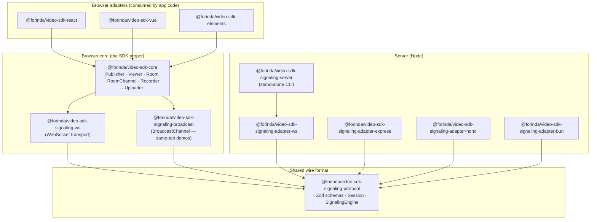

# Architecture

A 30-second tour of how the packages fit together and how a single RTC session flows through them.

## Package graph



**Reading the graph:** every arrow is a `dependencies` (or `peerDependencies`) edge in `package.json`. The wire-format package (`signaling-protocol`) is the only thing both browser and server link to — its zod schemas + `SignalingEngine` are the single source of truth for what travels on the wire.

## What lives where

| Package                                        | Responsibility                                                                                                                                                             | Runs in                                |
| ---------------------------------------------- | -------------------------------------------------------------------------------------------------------------------------------------------------------------------------- | -------------------------------------- |
| `core`                                         | WebRTC orchestration: `RTCPeerConnection` per viewer, perfect-negotiation, retry, stats, MediaRecorder wrapper, presence + chat layer (`RoomChannel`), `Room` coordinator. | Browser                                |
| `signaling-protocol`                           | Zod schemas for every wire message, plus a transport-agnostic `Session` engine that owns rooms + peer state.                                                               | Browser AND server (it's the contract) |
| `signaling-ws`                                 | `defineWebSocketSignaling({ url })` — the browser-side WebSocket transport. Handles auto-reconnect + heartbeat.                                                            | Browser                                |
| `signaling-broadcast`                          | `BroadcastChannel` transport for same-tab demos / dev fixtures.                                                                                                            | Browser                                |
| `signaling-adapter-ws`                         | Wires a Node `ws.WebSocketServer` to a `Session`. The thinnest server adapter.                                                                                             | Node                                   |
| `signaling-adapter-express` / `-hono` / `-bun` | Mount the WebSocket signaling server as part of an existing HTTP framework.                                                                                                | Node                                   |
| `signaling-server`                             | Standalone CLI that starts a `signaling-adapter-ws` on a port. Handy for examples + integration tests.                                                                     | Node                                   |
| `react`, `vue`, `elements`                     | Idiomatic adapter surfaces over `core`. Mirror the same hook/composable/element shape.                                                                                     | Browser                                |

## Data flow — one publisher, one viewer

```
┌─────────────────────────────────────────────┐
│ Tab A (publisher)                           │
│                                             │
│  getUserMedia() ──► definePublisher() ──┐   │
│                                         │   │
│                       │ on viewer-joined│   │
│                       ▼                 │   │
│              new RTCPeerConnection      │   │
│                       │                 │   │
│                       │ SDP offer       │   │
└───────────────────────┼─────────────────┼───┘
                        │                 │
                        ▼                 ▼
                ┌────────────────────────────┐
                │   WebSocket signaling      │
                │   (Server: signaling-      │
                │    adapter-ws → Session)   │
                │                            │
                │   Room: { alice, bob }     │
                └────────────┬───────────────┘
                             │ relay SDP/ICE
┌───────────────────────────┼─────────────────┐
│ Tab B (viewer)            │                 │
│                           ▼                 │
│  defineViewer() ◄──── peer-joined           │
│         │                                   │
│         ▼                                   │
│  new RTCPeerConnection                      │
│         │                                   │
│         ▼                                   │
│  on('track') ──► <video srcObject={…}>     │
└─────────────────────────────────────────────┘
```

**Key invariants:**

- The signaling server **never sees media bytes** — only SDP, ICE, presence, chat, and moderation messages. Media flows peer-to-peer once the WebRTC handshake completes.
- The `Session` is per-process state (rooms + sockets + peer index). Each socket binds at most one `(peerId, roomId)` after a successful `join`.
- `defineRoom` (browser side) wraps Publisher + Viewer + RoomChannel + Recorder under one transport so they share a single `join` — without it, each child would issue its own join and the engine would silently overwrite the prior peer binding.

## Connection lifecycle

The browser-side `Publisher` / `Viewer` / `RoomChannel` all use the same lifecycle vocabulary:

```
idle → connecting → connected → reconnecting → connected (loop) → closed
                              └→ failed (terminal: retry budget exhausted)
```

Backoff is `defineRetryPolicy` — exponential with jitter, bounded by `maxAttempts` + `maxDurationMs`. Each component holds its own policy, so a flaky publisher doesn't drain the viewer's budget.

## Where to read more

- **Per-package details:** each package's `README.md` is the canonical reference.
- **Recipes:** [`./patterns.md`](./patterns.md) — webinar / mesh / custom signaling.
- **Errors:** [`./troubleshooting.md`](./troubleshooting.md) — every typed error → cause → fix.
